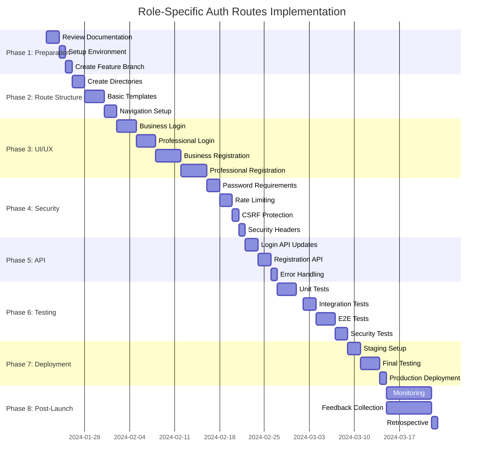

# Detailed Implementation Plan

## Overview
This document provides a comprehensive implementation plan for the role-specific login and registration system enhancement. The plan is divided into phases, with clear deliverables and timelines for each.

## Phase 1: Preparation and Setup

### Tasks
- [ ] Review current system documentation
- [ ] Set up development environment
- [ ] Create feature branch: `feature/role-specific-auth-routes`
- [ ] Update project documentation
- [ ] Conduct team kickoff meeting

### Deliverables
- Development environment ready
- Feature branch created
- Updated documentation
- Team alignment on goals

## Phase 2: Route Structure Implementation

### Tasks
- [ ] Create new directory structure for role-specific routes
- [ ] Set up basic page templates for all four new routes
- [ ] Implement route navigation and linking
- [ ] Add proper redirects from old routes
- [ ] Update main navigation to include new routes

### Deliverables
- Functional route structure
- Basic page templates
- Navigation working between routes
- Old routes properly redirected

## Phase 3: UI/UX Implementation

### Business Login Page (`/login/business`)
- [ ] Create business-specific login form
- [ ] Implement business-themed visuals
- [ ] Add role-specific messaging
- [ ] Ensure responsive design
- [ ] Add accessibility features

### Professional Login Page (`/login/professional`)
- [ ] Create professional-specific login form
- [ ] Implement professional-themed visuals
- [ ] Add role-specific messaging
- [ ] Ensure responsive design
- [ ] Add accessibility features

### Business Registration Page (`/register/business`)
- [ ] Create business registration form
- [ ] Implement business-specific fields
- [ ] Add validation and error handling
- [ ] Ensure responsive design
- [ ] Add accessibility features

### Professional Registration Page (`/register/professional`)
- [ ] Create professional registration form
- [ ] Implement professional-specific fields
- [ ] Add validation and error handling
- [ ] Ensure responsive design
- [ ] Add accessibility features

### Deliverables
- All four pages fully designed
- Responsive and accessible
- Role-specific visuals and messaging
- Consistent UI across all pages

## Phase 4: Security Enhancements

### Tasks
- [ ] Implement enhanced password requirements
- [ ] Add rate limiting to login attempts
- [ ] Implement CSRF protection
- [ ] Add security headers
- [ ] Implement session management improvements
- [ ] Add input validation and sanitization

### Deliverables
- Secure authentication system
- Protected against common vulnerabilities
- Proper error handling
- Secure session management

## Phase 5: API Integration

### Tasks
- [ ] Update login API to handle role-specific data
- [ ] Enhance registration API with additional validation
- [ ] Implement proper error responses
- [ ] Add logging for security events
- [ ] Ensure API security headers

### Deliverables
- Fully functional APIs
- Proper error handling
- Secure data transmission
- Comprehensive logging

## Phase 6: Testing

### Unit Testing
- [ ] Test individual components
- [ ] Test form validation
- [ ] Test API endpoints
- [ ] Test utility functions

### Integration Testing
- [ ] Test complete login flows
- [ ] Test complete registration flows
- [ ] Test navigation between routes
- [ ] Test API integration

### End-to-End Testing
- [ ] Test complete user journeys
- [ ] Test cross-browser compatibility
- [ ] Test mobile responsiveness
- [ ] Test accessibility compliance

### Security Testing
- [ ] Penetration testing
- [ ] Vulnerability scanning
- [ ] Security header validation
- [ ] Session management testing

### Deliverables
- Comprehensive test coverage
- All tests passing
- Security vulnerabilities addressed
- Performance optimized

## Phase 7: Deployment

### Tasks
- [ ] Create deployment plan
- [ ] Set up staging environment
- [ ] Conduct final testing in staging
- [ ] Prepare rollback plan
- [ ] Deploy to production
- [ ] Monitor post-deployment

### Deliverables
- Successful deployment
- Monitoring in place
- Rollback plan ready
- Production system stable

## Phase 8: Post-Launch

### Tasks
- [ ] Monitor system performance
- [ ] Gather user feedback
- [ ] Address any issues
- [ ] Conduct retrospective
- [ ] Document lessons learned

### Deliverables
- Stable production system
- User feedback collected
- Issues resolved
- Documentation updated

## Implementation Timeline

## Resource Allocation

### Team Members
- **Frontend Developer**: Primary responsibility for UI implementation
- **Backend Developer**: API integration and security enhancements
- **UX Designer**: Visual design and user experience
- **QA Engineer**: Testing and quality assurance
- **DevOps Engineer**: Deployment and infrastructure

### Tools and Technologies
- **Frontend**: Next.js, React, TypeScript
- **UI Framework**: Existing component library
- **Backend**: Node.js, Express
- **Database**: Existing database system
- **Testing**: Jest, Cypress, Postman
- **Security**: OWASP ZAP, Snyk

## Risk Assessment

### Potential Risks
1. **Scope Creep**: Stick to defined requirements
2. **Integration Issues**: Thorough testing between phases
3. **Security Vulnerabilities**: Regular security reviews
4. **Performance Issues**: Load testing before deployment
5. **User Adoption**: Clear communication and documentation

### Mitigation Strategies
- Regular progress reviews
- Comprehensive testing at each phase
- Security-focused code reviews
- Performance monitoring
- User feedback collection

## Success Criteria

### Technical Success
- All four new routes functional
- Secure authentication system
- Responsive and accessible design
- Comprehensive test coverage
- No critical security vulnerabilities

### User Success
- Improved user satisfaction scores
- Reduced support requests
- Increased registration conversion rates
- Positive user feedback
- Smooth transition from old system

### Business Success
- Aligned with business goals
- Improved brand perception
- Increased user engagement
- Measurable business impact
- Positive ROI on development effort

## Monitoring and Metrics

### Key Performance Indicators
- Page load times
- Conversion rates
- Error rates
- User satisfaction scores
- Support ticket volume

### Monitoring Tools
- Application performance monitoring
- Error tracking
- User analytics
- Security monitoring
- Log analysis

## Documentation Requirements

### Technical Documentation
- API documentation updates
- Component documentation
- Architecture diagrams
- Security procedures
- Deployment instructions

### User Documentation
- Updated help center articles
- FAQ updates
- Video tutorials (if needed)
- Release notes
- Migration guide

## Approval Process

### Review Points
1. Design review before implementation
2. Code review before testing
3. Security review before deployment
4. Final approval before production release

### Stakeholders
- Product Manager
- Technical Lead
- Security Team
- Marketing Team
- Customer Support

## Contingency Plan

### Rollback Procedure
- Maintain old routes during transition
- Implement feature flags for gradual rollout
- Prepare database backup before deployment
- Document rollback steps
- Test rollback procedure

### Communication Plan
- Internal team updates
- Stakeholder progress reports
- User communication for changes
- Support team preparation
- Post-launch announcements

## Implementation Checklist

- [ ] Phase 1: Preparation complete
- [ ] Phase 2: Route structure implemented
- [ ] Phase 3: UI/UX implementation complete
- [ ] Phase 4: Security enhancements implemented
- [ ] Phase 5: API integration complete
- [ ] Phase 6: Testing complete
- [ ] Phase 7: Deployment successful
- [ ] Phase 8: Post-launch activities complete

## Next Steps

1. Review this plan with the team
2. Assign specific tasks to team members
3. Set up project management tools
4. Begin Phase 1: Preparation
5. Schedule regular progress meetings