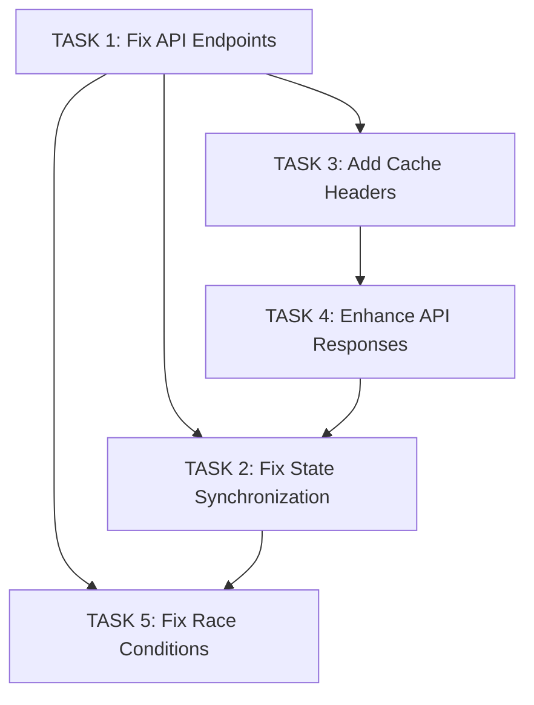

# Professionals Section Fix - Implementation Plan

## Overview

This document outlines a comprehensive implementation plan to fix 5 identified issues in the admin panel professionals section. The plan is organized in order of task dependencies, ensuring that foundational fixes are completed before dependent tasks.

## Issues Summary

| Issue | Description | Priority | Dependencies |
|-------|-------------|----------|--------------|
| 1 | Inconsistent API Endpoints | High | None |
| 2 | Missing State Synchronization | High | Issue 1, Issue 3 |
| 3 | Missing Cache Headers | Medium | None |
| 4 | Incomplete API Responses | Medium | None |
| 5 | State Race Conditions | High | Issue 1, Issue 2 |

## Task Dependencies Graph



## Detailed Implementation Plan

---

### Task 1: Fix Inconsistent API Endpoints

**Description**: Update frontend functions to use `/api/admin/professionals/{id}` instead of `/api/professionals/{id}` for all admin CRUD operations.

**Files to Modify**:
- [`src/app/dashboard/admin/page.tsx`](src/app/dashboard/admin/page.tsx)

**Specific Changes Required**:

1. **Line 1022** - `handleToggleProfessionalStatus()`:
   ```typescript
   // BEFORE:
   const response = await fetch(`/api/professionals/${professional.id}`, {
   
   // AFTER:
   const response = await fetch(`/api/admin/professionals/${professional.id}`, {
   ```

2. **Line 1076** - `confirmDeleteProfessional()`:
   ```typescript
   // BEFORE:
   const response = await fetch(`/api/professionals/${professionalToDelete.id}`, {
   
   // AFTER:
   const response = await fetch(`/api/admin/professionals/${professionalToDelete.id}`, {
   ```

3. **Line 1754** - `handleUpdateProfessional()`:
   ```typescript
   // BEFORE:
   const response = await fetch(
     `/api/professionals/${editingProfessional.id}`,
   
   // AFTER:
   const response = await fetch(
     `/api/admin/professionals/${editingProfessional.id}`,
   ```

**Verification/Test Steps**:
1. Toggle a professional's status and verify the request goes to `/api/admin/professionals/{id}`
2. Update a professional and verify the request goes to `/api/admin/professionals/{id}`
3. Delete a professional and verify the request goes to `/api/admin/professionals/{id}`
4. Verify all operations complete successfully with 200/201 status codes

**Dependencies**: None

---

### Task 2: Fix Missing State Synchronization

**Description**: Update `handleUpdateProfessional()` to properly synchronize state by updating both `professionals` and `professionalData` states, and calling `fetchProfessionals()` after successful updates.

**Files to Modify**:
- [`src/app/dashboard/admin/page.tsx`](src/app/dashboard/admin/page.tsx)

**Specific Changes Required**:

1. **Lines 1764-1777** - Update `handleUpdateProfessional()` to:
   - Update `professionalData` state in addition to `professionals` state
   - Call `fetchProfessionals()` after successful API response
   - Remove `setForceRerender()` call (not needed when using proper state sync)

   ```typescript
   // Add after successful API response:
   if (response.ok) {
     console.log("Account update successful, updating state...");
     
     // Update the professional in the professionals state
     setProfessionals((prev) =>
       prev.map((prof) =>
         prof.id === editingProfessional.id
           ? { ...prof, ...updateData }
           : prof
       )
     );
     
     // Also update professionalData state
     setProfessionalData((prev) => prev ? {
       ...prev,
       professionals: prev.professionals.map((prof) =>
         prof.id === editingProfessional.id
           ? { ...prof, ...updateData }
           : prof
       )
     } : null);
     
     // Refresh paginated data to ensure consistency
     fetchProfessionals();
     
     setShowRightPanel(false);
     setRightPanelContent(null);
     toast({
       title: 'Success',
       description: 'Professional account updated successfully!',
     });
   }
   ```

**Verification/Test Steps**:
1. Update a professional's name
2. Verify the name changes in the professionals table immediately
3. Navigate to another page and back to verify data persists
4. Check browser console for any state update errors
5. Verify pagination remains consistent after update

**Dependencies**:
- Task 1 (API Endpoints must use admin endpoint first)

---

### Task 3: Add Cache Control Headers to Professional APIs

**Description**: Add proper Cache-Control headers to all professional API responses to prevent browser caching of stale data.

**Files to Modify**:
- [`src/app/api/admin/professionals/route.ts`](src/app/api/admin/professionals/route.ts)
- [`src/app/api/professionals/[id]/route.ts`](src/app/api/professionals/[id]/route.ts)

**Specific Changes Required**:

1. **src/app/api/admin/professionals/route.ts**:
   - Import cache utilities: `import { getNoStoreHeaders } from '@/lib/cache'`
   - Add headers to GET response (line 89-97):
     ```typescript
     return NextResponse.json({
       professionals,
       pagination: {...}
     }, {
       headers: getNoStoreHeaders(),
     })
     ```
   - Add headers to POST response (line 200-216):
     ```typescript
     return NextResponse.json({...}, {
       status: 201,
       headers: getNoStoreHeaders(),
     })
     ```

2. **src/app/api/professionals/[id]/route.ts**:
   - Import cache utilities: `import { getNoStoreHeaders } from '@/lib/cache'`
   - Add headers to GET response (line 73):
     ```typescript
     return NextResponse.json({ professional }, {
       headers: getNoStoreHeaders(),
     })
     ```
   - Add headers to PUT response (line 140):
     ```typescript
     return NextResponse.json({ professional }, {
       headers: getNoStoreHeaders(),
     })
     ```
   - Add headers to DELETE response (line 195):
     ```typescript
     return NextResponse.json({ message: '...' }, {
       headers: getNoStoreHeaders(),
     })
     ```

**Verification/Test Steps**:
1. Make a GET request to `/api/admin/prof verify response headers:
essionals` and   - `Cache-Control: no-store, no-cache, must-revalidate, proxy-revalidate`
   - `Pragma: no-cache`
   - `Expires: 0`
2. Make a PUT request to `/api/professionals/{id}` and verify response headers
3. Verify browser doesn't cache professional data after updates
4. Test that refresh (F5) always fetches fresh data

**Dependencies**: None

---

### Task 4: Enhance Professional API Response Data

**Description**: Add `category` and `_count` fields to the professional GET API response to match the business API structure and enable proper stats display.

**Files to Modify**:
- [`src/app/api/admin/professionals/route.ts`](src/app/api/admin/professionals/route.ts)

**Specific Changes Required**:

1. **Lines 71-85** - Update the Prisma include clause in GET request:
   ```typescript
   const professionals = await db.professional.findMany({
     where: whereClause,
     include: {
       admin: {
         select: {
           id: true,
           email: true,
           name: true,
         },
       },
       // Add category (note: professionals may not have category, so use optional)
       category: {
         select: {
           id: true,
           name: true,
         },
       },
       // Add _count for related data
       _count: {
         select: {
           // Add any related counts that professionals might have
           // e.g., products, inquiries, etc. based on schema
         },
       },
     },
     orderBy: { [sortBy]: sortOrder },
     skip,
     take: limit,
   })
   ```

2. **Update TypeScript interfaces** in [`src/app/dashboard/admin/page.tsx`](src/app/dashboard/admin/page.tsx):
   - Update `Professional` interface (line 188-218) to include `category` and `_count` fields

**Verification/Test Steps**:
1. Call GET `/api/admin/professionals` and verify response includes `category` field
2. Call GET `/api/admin/professionals` and verify response includes `_count` field
3. Verify frontend can access these new fields without TypeScript errors
4. Verify category names display correctly in the professionals table

**Dependencies**: None

---

### Task 5: Fix State Race Conditions in Toggle Status

**Description**: Fix `handleToggleProfessionalStatus()` to avoid mixing different state sources and ensure consistent state updates.

**Files to Modify**:
- [`src/app/dashboard/admin/page.tsx`](src/app/dashboard/admin/page.tsx)

**Specific Changes Required**:

1. **Lines 1017-1057** - Refactor `handleToggleProfessionalStatus()`:
   - Remove direct `setProfessionals()` update (inconsistent with paginated data)
   - Keep `setStats()` update for immediate UI feedback
   - Keep `fetchProfessionals()` call for data refresh
   - Add `setProfessionalData()` update for consistency

   ```typescript
   const handleToggleProfessionalStatus = useCallback(
     async (e: React.MouseEvent, professional: Professional) => {
       e.preventDefault();
       setProfessionalToggleLoading(professional.id);
       try {
         const response = await fetch(`/api/admin/professionals/${professional.id}`, {
           method: 'PUT',
           headers: { 'Content-Type': 'application/json' },
           body: JSON.stringify({ isActive: !professional.isActive }),
         });
   
         if (response.ok) {
           // Update stats immediately for responsive UI
           setStats((prev) => ({
             ...prev,
             activeProfessionals: !professional.isActive
               ? prev.activeProfessionals + 1
               : prev.activeProfessionals - 1,
           }));
           
           // Remove direct professionals state update - let fetchProfessionals handle it
           // This avoids race conditions with paginated data
           
           // Refresh paginated data
           fetchProfessionals();
           
           toast({
             title: 'Success',
             description: `Professional ${!professional.isActive ? 'activated' : 'deactivated'} successfully`,
           });
         } else {
           const error = await response.json();
           toast({ title: 'Error', description: `Failed to update status: ${error.error || 'Unknown error'}`, variant: 'destructive' });
         }
       } catch (error) {
         toast({ title: 'Error', description: 'Failed to toggle status', variant: 'destructive' });
       } finally {
         setProfessionalToggleLoading(null);
       }
     },
     [toast, fetchProfessionals]
   );
   ```

2. **Lines 1076-1103** - Refactor `confirmDeleteProfessional()` similarly:
   - Remove direct `setProfessionals()` update
   - Keep `setStats()` update
   - Keep `fetchProfessionals()` call

**Verification/Test Steps**:
1. Toggle a professional's status
2. Verify the status badge updates correctly in the UI
3. Verify the stats (active professionals count) update correctly
4. Navigate away and back to verify data consistency
5. Check for any console warnings about state updates
6. Verify multiple rapid toggles don't cause race conditions

**Dependencies**:
- Task 1 (API Endpoints must be fixed first)
- Task 2 (State synchronization pattern established)

---

## Execution Order

| Order | Task | Reason |
|-------|------|--------|
| 1 | Task 3: Add Cache Headers | Foundation fix, no dependencies |
| 2 | Task 4: Enhance API Responses | Foundation fix, no dependencies |
| 3 | Task 1: Fix API Endpoints | Required for Tasks 2 and 5 |
| 4 | Task 2: Fix State Synchronization | Depends on Task 1 |
| 5 | Task 5: Fix Race Conditions | Depends on Tasks 1 and 2 |

## Testing Strategy

### Manual Testing Checklist

- [ ] Toggle professional status and verify UI updates
- [ ] Update professional details and verify table refreshes
- [ ] Delete professional and verify removal from table
- [ ] Verify pagination remains consistent after all operations
- [ ] Check browser network tab for correct API endpoints
- [ ] Verify response headers include Cache-Control
- [ ] Verify new fields (category, _count) appear in API responses

### Automated Test Cases (To Be Created)

```typescript
// Example test cases for professional API
describe('Professional API', () => {
  it('should return cache-control headers', async () => {
    // Test Task 3
  });
  
  it('should include category and _count in response', async () => {
    // Test Task 4
  });
});

// Example test cases for frontend
describe('Professional Management', () => {
  it('should use admin API endpoint for updates', async () => {
    // Test Task 1
  });
  
  it('should refresh table after professional update', async () => {
    // Test Task 2
  });
  
  it('should handle rapid status toggles without race conditions', async () => {
    // Test Task 5
  });
});
```

## Risk Assessment

| Risk | Impact | Mitigation |
|------|--------|------------|
| Breaking existing functionality | High | Test each task in isolation; rollback plan ready |
| TypeScript errors from new fields | Medium | Update interfaces before implementing Task 4 |
| State update timing issues | Medium | Use optimistic updates carefully; test thoroughly |

## Rollback Plan

If issues arise after implementation:

1. **Task 1, 2, 5**: Revert changes to `src/app/dashboard/admin/page.tsx`
2. **Task 3, 4**: Revert changes to API route files

All changes are localized to specific files and functions, making rollback straightforward.
