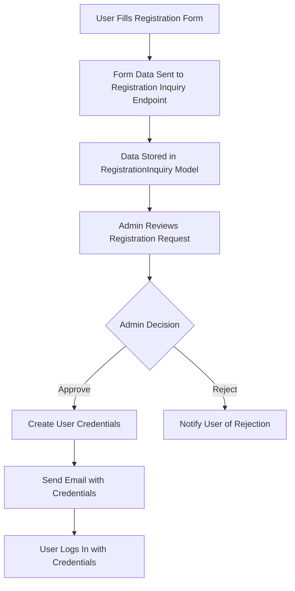

# Registration Workflow Plan

## Overview
This document outlines the comprehensive plan for implementing the registration workflow for businesses and professionals. The workflow involves capturing user registration requests, sending them to the admin panel for approval, and creating user credentials upon approval.

## Current Issue
The registration form for businesses and professionals is currently returning a 404 error because the endpoint `/api/auth/register/business` did not exist. This has been fixed by creating the endpoint, but the workflow needs to be adjusted to match the user's requirements.

## User Requirements
1. Users fill out a registration form with their details.
2. The form data is sent to the admin panel under "Registration Requests."
3. The admin reviews and approves the registration request.
4. Upon approval, the system creates user credentials (email and password).
5. Users receive their credentials and can log in using the login page.

## Proposed Workflow

### 1. Registration Form Submission
- Users fill out the registration form for businesses or professionals.
- Form data is submitted to the respective registration inquiry endpoint.
- Data is stored in the `RegistrationInquiry` model for admin review.

### 2. Admin Review and Approval
- Admins access the admin panel to view pending registration requests.
- Admins review the details and approve or reject the request.
- Upon approval, the system generates user credentials and creates the user account.

### 3. User Notification
- Users receive an email with their credentials (email and password).
- Users can then log in using the provided credentials.

## Implementation Plan

### Step 1: Update Registration Form
- Modify the registration form to submit data to the `RegistrationInquiry` endpoint instead of directly creating a user.
- Ensure the form captures all necessary details for businesses and professionals.

### Step 2: Create Registration Inquiry Endpoint
- Ensure the `RegistrationInquiry` endpoint is set up to receive and store registration requests.
- Validate the incoming data and store it in the database.

### Step 3: Admin Panel Integration
- Create an admin panel interface to view and manage registration requests.
- Allow admins to approve or reject requests.
- Upon approval, trigger the user creation process.

### Step 4: User Creation Process
- When a registration request is approved, create a user account with the provided details.
- Generate a secure password and store it in the database.
- Send an email to the user with their credentials.

### Step 5: Email Notification
- Implement an email service to send credentials to users upon approval.
- Ensure the email includes the login URL and instructions.

### Step 6: Testing and Validation
- Test the entire workflow from form submission to user login.
- Validate that all steps work as expected and handle edge cases.

## Detailed Steps

### 1. Update Registration Form
- Modify the form submission logic to send data to `/api/registration-inquiries`.
- Ensure the form captures all required fields for businesses and professionals.

### 2. Create Registration Inquiry Endpoint
- Ensure the endpoint validates and stores the registration request.
- Return a success message to the user indicating that their request is under review.

### 3. Admin Panel Integration
- Create a new section in the admin panel for "Registration Requests."
- Display a list of pending requests with options to approve or reject.
- Upon approval, trigger the user creation process.

### 4. User Creation Process
- Create a new endpoint to handle user creation upon approval.
- Generate a secure password and store it in the database.
- Send an email to the user with their credentials.

### 5. Email Notification
- Implement an email service using a library like Nodemailer.
- Create email templates for sending credentials to users.
- Ensure the email includes the login URL and instructions.

### 6. Testing and Validation
- Test the entire workflow from form submission to user login.
- Validate that all steps work as expected and handle edge cases.

## Mermaid Diagram

## Conclusion
This plan outlines the steps required to implement the registration workflow as per the user's requirements. The workflow ensures that user registration requests are reviewed by admins before creating user credentials, providing a secure and controlled registration process.